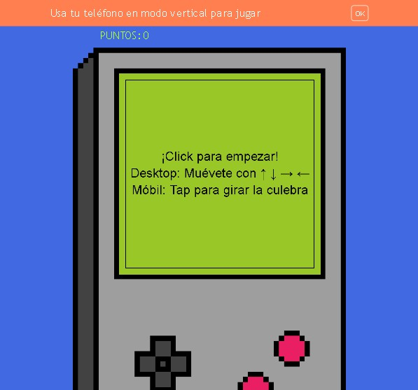

# Juego culebra

   

## Características

- Jugabilidad Intuitiva: Controles simples que facilitan la experiencia de juego.
- Desafíos Aumentativos: La dificultad aumenta a medida que la culebra crece, ¡poniendo a prueba tus reflejos!
- Gráficos Coloridos: Un diseño visual atractivo que hará que quieras jugar una y otra vez.

## Tecnologías Utilizadas

- **HTML**: Estructura básica de la aplicación.
- **CSS**: Estilos y diseño visual.
- **JavaScript**: Lógica para generar contraseñas.

## Instalación

1. Clona este repositorio en tu máquina local:
bash
   git clone https://github.com/nanditavelasquez/juego_culebra.git
   
2. Navega al directorio del proyecto:
bash
   cd generador-contraseñas

3. Abre el archivo index.html en tu navegador web.

## Uso

- Usa las teclas de dirección para mover la culebra, si estas en el celular da click en la pantalla.
- Come la comida para crecer.
- Evita chocar con las paredes y con tu cola.

## Contribuciones

Las contribuciones son bienvenidas. Si encuentras algún error o tienes sugerencias para mejorar el reproductor, por favor abre un *issue* o crea una *pull request*.

